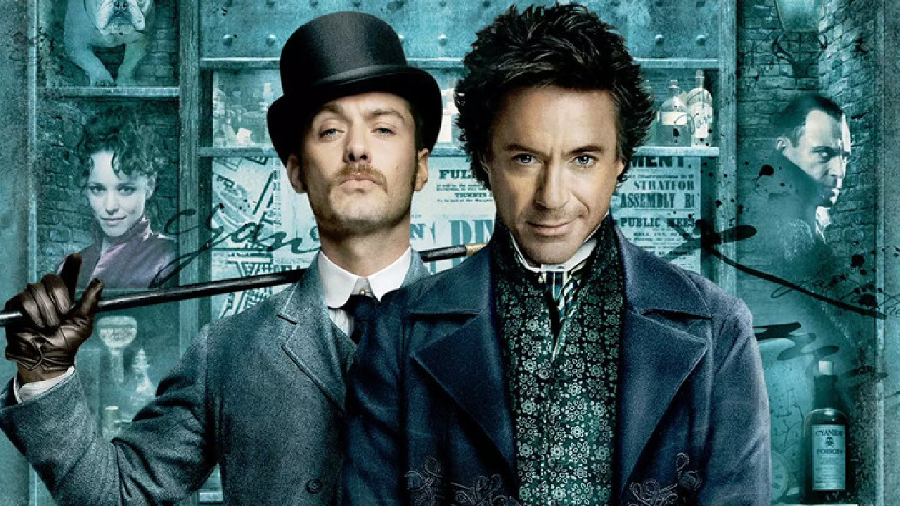

# Büşra Rıfatoğlu
## Hakkımda
Merhaba ben Büşra Rıfatoğlu. İstanbulda yaşıyorum. Web geliştirme ile ilgileniyorum. 
Kodlamaya olan ilgim üzerine lise ve üniversite hayatımda birden fazla programlama dili öğrendim.Aldığım bu eğitimlerim sayesinde birden fazla programlama diline hakimim.
Kendimi geliştirmek için sürekli çalışma halindeyim.Kodluyoruzun verdiği frontend eğitimi ile bilgilerimi yenileyip kendimi geliştirmiş oluyorum.

## İlgi Alanlarım
-  Film   
    * Karayip Korsanları
    * Hızlı ve Öfkeli
- Dizi
    * [The Walking Dead](https://www.imdb.com/title/tt1520211/?ref_=nv_sr_srsg_0)
    * La Casa de Papel
    * Leyla ile Mecnun
    *  Sherlock Holmes
- Kitap
    * [Küçük Prens](https://www.goodreads.com/book/show/157993.The_Little_Prince)
    * Dönüşüm
    * Gurur ve Önyargı

## Sevdiğim Dizi

 Sherlock dizisi gerilim türünde oldukça fazla sevilmekte olan bir dizidir.  Bütün gerçekleşen olaylarda detayları oldukça iyi gözlemleyen ve çözme yeteneğine sahip olan dedektif olayların aydınlatılması ile bilinen bir dizidir.
